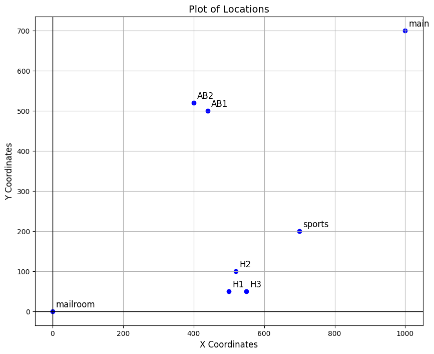
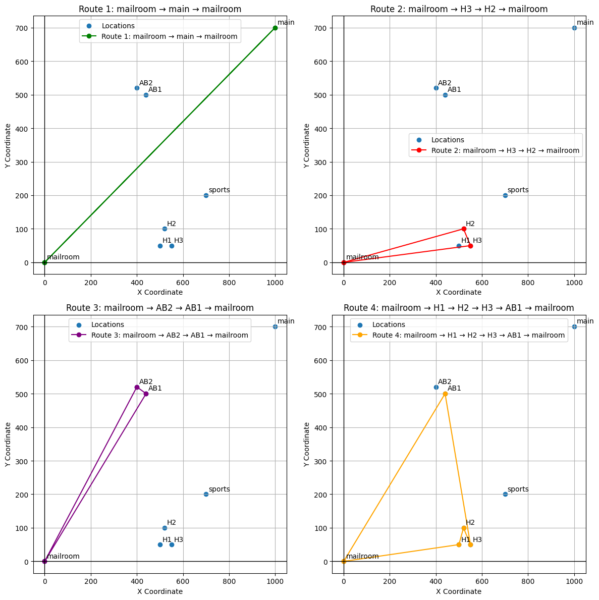

# MailPal: Min–Max Optimization for Multi-Agent Task Scheduling in Heterogeneous Systems

This repository contains the code and report for the course project for the course Applied Optimisation (DSE-311) undertaken in the winter semester at IISER Bhopal under the supversion of Prof. Sujit PB.

## Requirements
Use the following command to install necessary libraries. Execute the following command:

```bash
pip install networkx
```

# Reproduce the Code

- To run the model use the following command:

```bash
python model.py
```

## Environment


## Result

